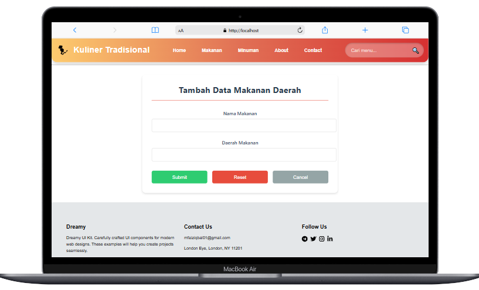

# UAS_Pemrograman Web1 

## PROFIL

|  |  |
| -------- | --- |
| **Nama** | Muhammad Faiz Iqbal |
| **Kelas** | TI.23.A.5 |
| **Mata Kuliah** | Pemrograman Web 1 |
| **Dosen Pengampu** | Eko Budiarto S.kom, M.kom |
---

# 🍚 Jejak Kuliner Tradisional 

**Deskripsi Singkat**

**Jejak Kuliner Tradisional** adalah sebuah platform berbasis web yang menampilkan berbagai makanan dan minuman khas Nusantara. Proyek ini bertujuan untuk memperkenalkan keragaman kuliner Indonesia kepada masyarakat luas dengan cara yang menarik dan interaktif.

---

# Fitur Utama

## Halaman Home

Menampilkan informasi umum dan pengantar tentang Jejak Rasa Nusantara.

---

### Tampilan Halaman Home

Halaman Home dari proyek ini  merupakan halaman utama yang dirancang untuk memperkenalkan platform ini kepada pengguna. Halaman ini terdiri dari beberapa bagian utama:

**1. Hero Section**

**2. Culinary Showcase**

**3. Footer**

Halaman ini menggunakan Bootstrap untuk tata letak yang responsif, Google Fonts untuk tampilan yang modern, serta PHP untuk mengisi konten secara dinamis. Desainnya simpel namun elegan, memberikan pengalaman yang mudah dan menarik bagi pengguna.

---

## Halaman Makanan Kuliner Tradisional

Halaman ini menampilkan daftar makanan khas Daerah Indonesia Data disajikan dalam bentuk tabel dan mendukung fungsi CRUD (Create, Read, Update, Delete).

---

### Tampilan Halaman Makanan & Minuman

---

#### 1. Header Halaman

- **Judul Halaman:**
  - Menampilkan judul **"Data Makanan Nusantara"** dilengkapi dengan ikon `fa-utensils` (simbol alat makan).
- **Tombol "Tambah Data":**
  - Terletak di sebelah kanan header.
  - Mengarahkan pengguna ke halaman **makananAdd** dengan parameter query string `?page=makananAdd`.
  - Memungkinkan pengguna untuk menambahkan data baru ke dalam daftar.

#### 2. Tabel Data

Tabel digunakan untuk menampilkan daftar data makanan dengan kolom sebagai berikut:

- **No:** Menampilkan nomor urut data.
- **Nama Makanan:** Nama makanan khas Nusantara.
- **Daerah Asal:** Informasi mengenai asal daerah makanan tersebut.
- **Aksi:** Tombol untuk melakukan tindakan seperti mengedit dan menghapus data.

### Fitur CRUD

Halaman ini mendukung fungsi CRUD sebagai berikut:

1. **Create (Tambah Data):**

   

   - Tombol **"Tambah Data"** mengarahkan pengguna ke form untuk menambahkan data makanan baru.

2. **Read (Baca Data):**

   

   - Data ditampilkan dalam bentuk tabel yang memuat informasi makanan khas Nusantara.

---

## Halaman About

Halaman **About** ini memberikan informasi tentang platform kuliner Tradisional yang menghubungkan pencinta makanan dengan berbagai hidangan autentik dari setiap daerah - daerah Indonesia.

---

### Tampilan Halaman About

---

1. **Hero Section**

   - Menampilkan gambar latar belakang yang menggambarkan restoran atau kuliner Indonesia.
   - Judul besar "Temukan Jejak Rasa Nusantara" dan subjudul "Menghadirkan pengalaman kuliner autentik dengan sentuhan modern" untuk menarik perhatian pengunjung.

2. **About Section**

   - Menjelaskan visi dan misi dari Culinary Journey, yang berkomitmen untuk melestarikan warisan kuliner Indonesia, mendukung UMKM kuliner lokal, dan menghadirkan inovasi dalam penyajian.
   - Terdapat gambar restoran sebagai ilustrasi.

3. **Stats Section**
   - Menampilkan statistik yang menggambarkan kesuksesan Culinary Journey, termasuk jumlah resep makanan, chef profesional, cabang restoran.

---

## Halaman Contact

Website **Jejak Rasa Nusantara** memiliki halaman **Kontak Kami** yang memungkinkan pengunjung untuk menghubungi tim kami dengan mudah. Halaman ini terdiri dari dua bagian utama: informasi kontak dan formulir kontak.

---

### Tampilan Halaman Contact

---

#### 1. **Informasi Kontak**

- Bagian ini berisi informasi penting yang terbagi dalam beberapa item kontak, masing-masing menampilkan:

  - **Lokasi Kami**: Alamat lengkap untuk mengunjungi kami.
  - **Telepon**: Nomor telepon yang bisa dihubungi.
  - **Email**: Alamat email untuk pertanyaan atau dukungan lebih lanjut.
  
  Setiap item informasi dilengkapi dengan ikon terkait (misalnya, peta untuk lokasi, telepon untuk nomor telepon, dan sebagainya).

#### 3. **Formulir Kontak**

- Pengunjung dapat mengisi **formulir** untuk mengirim pesan kepada kami.

  - **Nama Lengkap**: Untuk mengetahui pengirim pesan.
  - **Email**: Untuk menghubungi kembali pengunjung.
  - **Nomor Telepon**: Sebagai alternatif kontak.
  - **Subjek**: Topik atau alasan pengunjung menghubungi.
  - **Pesan**: Pesan yang ingin disampaikan kepada tim kami.

  Setelah mengisi formulir, pengunjung dapat mengirim pesan menggunakan tombol **Kirim Pesan**.

#### 4. **Bagian Media Sosial**

- Pengunjung dapat mengikuti kami di platform media sosial melalui tautan yang tersedia (Telegram, Twitter, Instagram, LinkedIn).

Pastikan webserver Apache & MySQLsudah dijalankan. Kemudian untuk mengakses direktory tersebut pada web server dengan mengakses URL : http://localhost/Kuliner%20No%20BS5/?page=home

---

## SELESAI  

- Email: mfaiziqbal01@gmail.com

 
